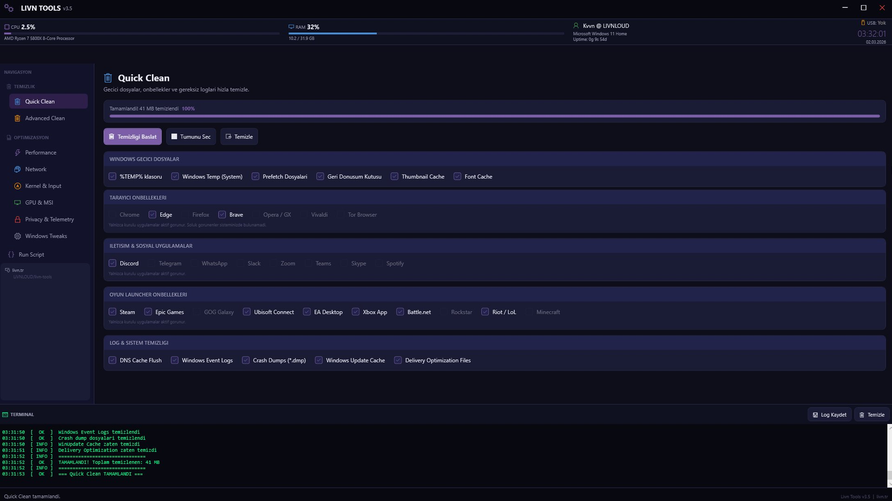
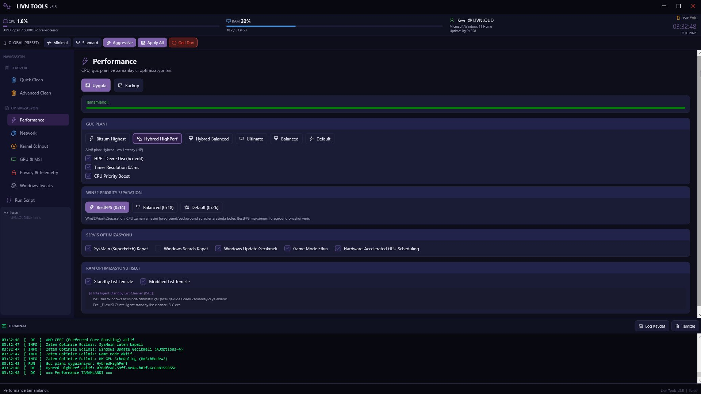
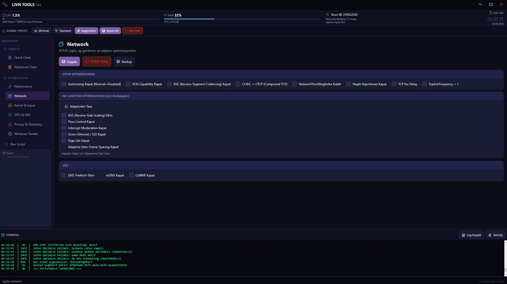
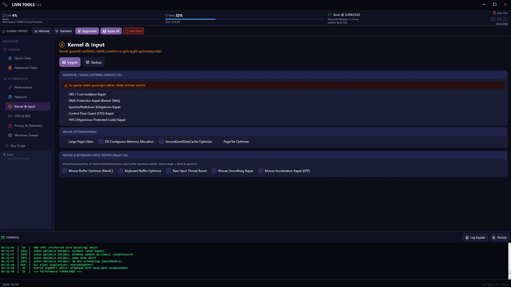
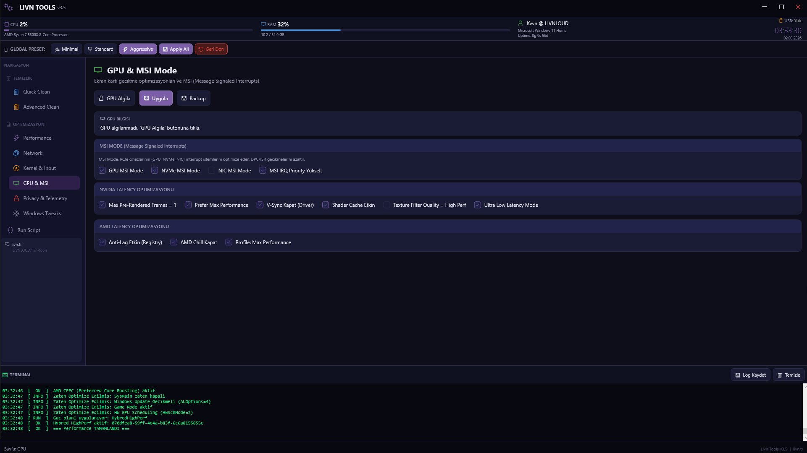
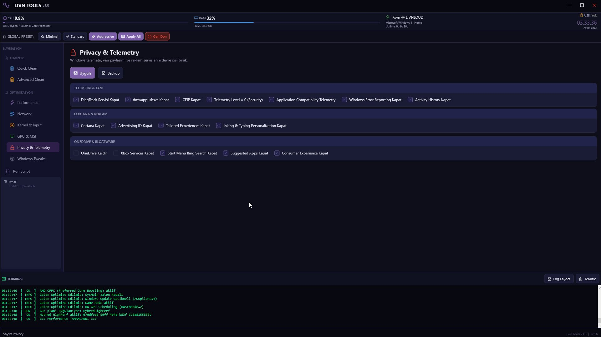
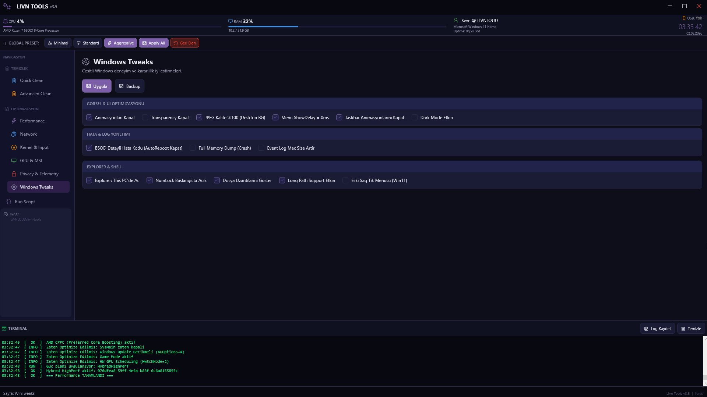
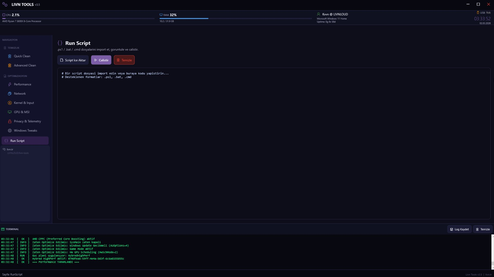

<div align="center">

# ⚡ Livn Tools v3.5

**Windows 10/11 için sistem optimizasyon aracı**

[](https://github.com/PowerShell/PowerShell)
[](https://www.microsoft.com/windows)
[](LICENSE)
[](https://github.com/LiVNLOUD/livn-tools/releases)

</div>

---

## 🚀 Hızlı Kurulum

PowerShell'i **Yönetici olarak** açın ve yapıştırın:

```powershell
irm livn.tr/win | iex
```

> Araç `Documents\LivnTools` klasörüne kurulur ve otomatik başlar.

---

## 📸 Ekran Görüntüleri

<table>
  <tr>
    <td align="center"><b>Quick Clean</b></td>
    <td align="center"><b>Performance</b></td>
  </tr>
  <tr>
    <td></td>
    <td></td>
  </tr>
  <tr>
    <td align="center"><b>Network</b></td>
    <td align="center"><b>Kernel & Input</b></td>
  </tr>
  <tr>
    <td></td>
    <td></td>
  </tr>
  <tr>
    <td align="center"><b>GPU & MSI</b></td>
    <td align="center"><b>Privacy & Telemetry</b></td>
  </tr>
  <tr>
    <td></td>
    <td></td>
  </tr>
  <tr>
    <td align="center"><b>Windows Tweaks</b></td>
    <td align="center"><b>Run Script</b></td>
  </tr>
  <tr>
    <td></td>
    <td></td>
  </tr>
</table>

---

## 🗂 Dosya Yapısı

```
LivnTools/
├── Main.ps1                                    ← Ana script (XAML UI + Backend)
├── LivnTools.bat                               ← Manuel başlatıcı (Admin olarak çalıştır)
├── win.ps1                                     ← Uzak yükleyici (irm livn.tr/win | iex)
├── _Files/
│   ├── Backups/                                ← Registry yedekleri (.reg)
│   ├── Logs/                                   ← Terminal log dosyaları (.txt)
│   ├── Bitsum-Highest-Performance.pow          ← Bitsum güç planı
│   ├── HybredPowerPlans/
│   │   ├── HybredLowLatencyHighPerf.pow        ← Hybred HighPerf güç planı
│   │   └── HybredLowLatencyBalanced.pow        ← Hybred Balanced güç planı
│   ├── Win32Prio_BestFPS_TheHybred.reg         ← Win32Priority tweak (0x14)
│   ├── Win32Prio_Balanced_TheHybred.reg        ← Win32Priority tweak (0x18)
│   ├── Win32Prio_Default_TheHybred.reg         ← Win32Priority tweak (0x26)
│   └── ISLC/
│       └── Intelligent standby list cleaner ISLC.exe  ← RAM optimizasyonu
└── docs/
    └── screenshots/                            ← Ekran görüntüleri
```

---

## 🛠 Özellikler

### 🧹 Temizlik
| Sekme | İçerik |
|-------|--------|
| **Quick Clean** | %TEMP%, System Temp, Prefetch, RecycleBin, Thumbnail/Font cache, DNS flush, Tarayıcı cache (Chrome/Edge/Firefox/Brave/Opera/Vivaldi/Tor), İletişim uygulamaları (Discord/Telegram/Slack/Zoom/Teams/Skype/Spotify), Oyun launcher'ları (Steam/Epic/GOG/Ubisoft/EA/Xbox/Battle.net/Rockstar/Riot/Minecraft), Event Logs, Crash Dumps, WinUpdate cache, Delivery Optimization |
| **Advanced Clean** | WinSxS (DISM), SFC/DISM onarım, Hibernation, PageFile temizleme, USB bağlantı geçmişi |

### ⚡ Optimizasyon
| Sekme | İçerik |
|-------|--------|
| **Performance** | HPET (bcdedit), Timer Resolution 0.5ms, CPU Priority Boost, SysMain/WSearch kapatma, Game Mode, HW GPU Scheduling, **Güç planı seçimi** (Bitsum / Hybred HighPerf / Hybred Balanced / Ultimate / Balanced / Default), **Win32PrioritySeparation** (BestFPS 0x14 / Balanced 0x18 / Default 0x26), **RAM Optimizasyonu** (ISLC — Standby/Modified List temizleme + Görev Zamanlayıcı) |
| **Network** | TCP AutoTuning, ECN, RSC, Congestion (CTCP), NetworkThrottlingIndex, Nagle/TCPNoDelay/TcpAckFrequency, RSS, NIC adapter tweaks (Flow Control, Interrupt Moderation, Green Ethernet, Giga Lite), DNS Prefetch, LLMNR/mDNS kapatma |
| **Kernel & Input** | VBS, DMA Protection, Spectre/Meltdown mitigation, CFG, HVCI, Large Pages, DX Contiguous Memory, SecondLevelDataCache, PageFile optimize, Mouse/Keyboard buffer (MarkC Fix), Raw Input boost, Mouse Smoothing/Acceleration kapatma |
| **GPU & MSI** | GPU algılama, MSI Mode (GPU/NVMe/NIC), IRQ Priority yükseltme, NVIDIA latency tweaks (PreRender/Power/VSync/ShaderCache/ULLS), AMD Anti-Lag/Chill/Power tweaks |

### 🔒 Gizlilik & Sistem
| Sekme | İçerik |
|-------|--------|
| **Privacy & Telemetry** | DiagTrack, dmwappushvc, CEIP, Telemetry Level 0, App Compat Telemetry, Error Reporting, Activity History, Cortana, Advertising ID, Tailored Experiences, Inking Personalization, OneDrive kaldırma, Xbox Services, Bing Search, Suggested Apps, Consumer Experience |
| **Windows Tweaks** | Animasyon kapatma, Transparency, JPEG kalite %100, MenuShowDelay=0ms, Taskbar animasyonları, Dark Mode, BSOD detay kodu, Full Memory Dump, Explorer This PC, NumLock, Dosya uzantıları, Long Path Support, Eski sağ tık menüsü (Win11) |
| **Run Script** | .ps1 / .bat / .cmd dosyası import et ve çalıştır |

---

## 🎛 Global Presets

| Preset | Açıklama |
|--------|----------|
| **Minimal** | Sadece temel, risksiz temizlik ve stabilite tweaks |
| **Standard** | Gaming + Streaming için dengeli ayarlar |
| **Aggressive** | Maksimum performans, düşük latency odaklı |
| **Geri Dön** | Uygulanan tüm değişiklikleri geri al |

---

## 💾 Backup Sistemi

Her optimizasyon sayfasında **Backup** butonu bulunur. Uygula'ya basmadan önce yedek almak için Backup butonuna tıklayın. Yedekler `_Files\Backups` klasörüne `.reg` formatında kaydedilir.

> ⚠️ Yedekleme **manueldir** — Backup butonuna siz tıklarsınız.

---

## ⚙️ Gereksinimler

- Windows 10 veya Windows 11
- PowerShell 5.1+
- Yönetici (Administrator) yetkisi

---

## 📋 Manuel Kullanım

`irm` komutunu kullanmak istemiyorsanız:

1. Bu repoyu ZIP olarak indirin
2. `LivnTools.bat` dosyasına sağ tıklayın → **Yönetici olarak çalıştır**

---

## ⚠️ Sorumluluk Reddi

Bu araç registry ve sistem ayarlarında değişiklik yapar. **Uygulama öncesi Backup butonuna tıklamanız önerilir.** Kullanım tamamen kendi sorumluluğunuzdadır.

---

<div align="center">

**[livn.tr](https://livn.tr)** · **[GitHub](https://github.com/LiVNLOUD/livn-tools)**

</div>
